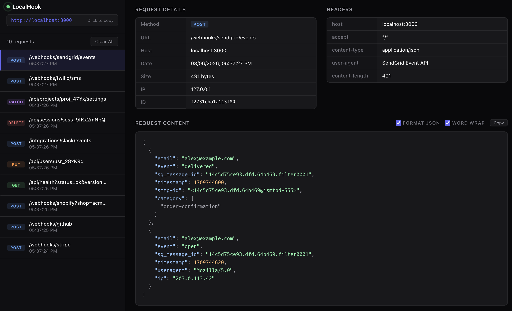

# LocalHook

Local webhook testing tool. Like [webhook.site](https://webhook.site), but on your machine.

Send webhooks to `localhost` instead of a third-party service. Inspect request details, headers, and body in a real-time dashboard.



## Quick Start

```bash
npx @cmer/localhook
```

Then send requests to `http://localhost:3000/any-path` (or the public URL) and watch them appear in the dashboard.

## Usage

```bash
# Default port 3000
npx @cmer/localhook

# Custom port
npx @cmer/localhook --port 8080

# Expose via Tailscale Funnel
npx @cmer/localhook --tailscale

# Expose via Cloudflare Quick Tunnel (no account required)
npx @cmer/localhook --cloudflare

# Custom port with Tailscale
npx @cmer/localhook --port 8080 --tailscale

# Allow dashboard access from the public URL (password-protected)
npx @cmer/localhook --tailscale --allow-remote-access --password mysecret

# Forward webhooks to your local app
npx @cmer/localhook --forward-to http://localhost:4444

# Forward with a base path
npx @cmer/localhook --forward-to http://localhost:4444/api/webhooks
```

| Flag | Short | Description |
|---|---|---|
| `--port <port>` | `-p` | Port to listen on (default: 3000) |
| `--tailscale` | | Start Tailscale Funnel for a public HTTPS URL |
| `--cloudflare` | | Start Cloudflare Quick Tunnel for a public HTTPS URL |
| `--allow-remote-access` | | Allow dashboard/API access from non-localhost (e.g. via tunnel) |
| `--password <value>` | | Require HTTP Basic Auth for remote dashboard/API access (localhost is never challenged) |
| `--data-file <path>` | | Path to data file (default: `~/.localhook/data.json`) |
| `--forward-to <url>` | | Forward incoming webhooks to a local app (preserves method, path, headers, body) |
| `--help` | `-h` | Show help |

Open `http://localhost:3000` in your browser to see the dashboard.

Any HTTP request to any path (except `/`) gets captured:

```bash
curl -X POST http://localhost:3000/webhook \
  -H "Content-Type: application/json" \
  -d '{"event": "user.created", "user_id": "123"}'
```

Incoming requests are also logged in the terminal:

```
  3/6/2026 5:37:24 PM  POST    /webhooks/stripe  494b  application/json
  3/6/2026 5:37:25 PM  GET     /api/health?status=ok
  3/6/2026 5:37:26 PM  DELETE  /api/sessions/sess_9fKx2mNpQ
```

## Features

- **Public HTTPS Tunnel** -- built-in support for HTTPS tunnel via Tailscale or Cloudflare
- **Real-time** -- requests appear instantly via Server-Sent Events, no refresh needed
- **All HTTP methods** -- GET, POST, PUT, PATCH, DELETE, HEAD, OPTIONS
- **Request inspection** -- method, URL, headers, query parameters, body
- **JSON formatting** -- auto-detects and pretty-prints JSON with syntax highlighting
- **Zero config** -- no database, no build step, no accounts
- **Terminal logging** -- see requests in your terminal without opening the dashboard

## Webhook Forwarding

Use `--forward-to` to forward incoming webhooks to your local application while still capturing them in the dashboard:

```bash
npx @cmer/localhook --forward-to http://localhost:4444
```

Every captured webhook is forwarded synchronously — your app receives the original HTTP method, path, query string, headers (including signature headers like `x-stripe-signature`), and body. The caller (e.g. Stripe) receives your app's actual response, so retries work correctly on 5xx errors.

You can also specify a base path that gets prepended to the webhook path:

```bash
# Webhook to /events → forwarded to http://localhost:4444/api/webhooks/events
npx @cmer/localhook --forward-to http://localhost:4444/api/webhooks
```

The dashboard shows forwarding results: status code, duration, and response body for each request. If the target is unreachable, the caller receives a 502 and the error is displayed in the dashboard.

Combine with a tunnel for end-to-end webhook testing:

```bash
npx @cmer/localhook --cloudflare --forward-to http://localhost:4444
```

## Testing with External Services

If you need to receive webhooks from external services like Stripe, GitHub, or Shopify, they need a public URL to send requests to.

### Tailscale Funnel (built-in)

My favorite. Use the `--tailscale` flag to automatically start [Tailscale Funnel](https://tailscale.com/kb/1223/funnel) alongside LocalHook:

```bash
npx @cmer/localhook --tailscale
```

This gives you a public HTTPS URL like `https://myhost.tail1234.ts.net`. Use that as your webhook URL in Stripe, GitHub, etc.

Requires [Tailscale](https://tailscale.com/) to be installed with [Funnel enabled](https://tailscale.com/kb/1223/funnel). 

### Cloudflare Quick Tunnel (built-in)

Use the `--cloudflare` flag to start a [Cloudflare Quick Tunnel](https://developers.cloudflare.com/cloudflare-one/connections/connect-networks/do-more-with-tunnels/trycloudflare/) — no account or login required:

```bash
npx @cmer/localhook --cloudflare
```

This gives you a public HTTPS URL like `https://random-words.trycloudflare.com`. Use that as your webhook URL in Stripe, GitHub, etc.

Requires [`cloudflared`](https://developers.cloudflare.com/cloudflare-one/connections/connect-networks/downloads/) to be installed. The URL changes each time you restart.

> **Note:** `--tailscale` and `--cloudflare` are mutually exclusive — use one or the other.

> **Note:** The dashboard is always restricted to localhost by default. Requests through reverse proxies (Tailscale Funnel, ngrok, Cloudflare Tunnel, etc.) are automatically detected and blocked from accessing the dashboard. Use `--allow-remote-access` to override this, and `--password` to require authentication for remote access.

### Other tunneling services

You can also use any other tunneling service manually, such as ngrok.

## REST API

LocalHook has a REST API for programmatic access to captured webhooks. See [API.md](API.md) for full documentation with example requests.

## How It Works

LocalHook runs a single Express server. `GET /` serves the dashboard. Every other request is captured as a webhook and broadcast to the dashboard via SSE.

Data is stored in `~/.localhook/data.json` by default (max 500 entries). Use `--data-file` to override.

## License

MIT
